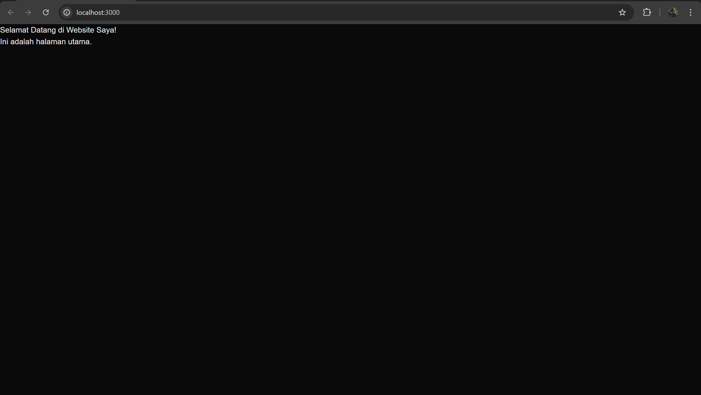
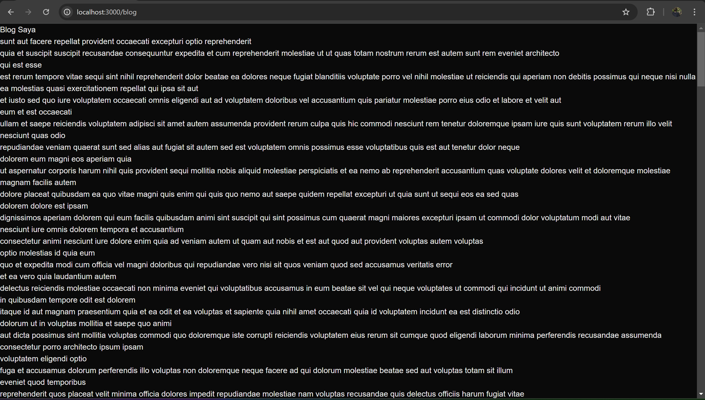
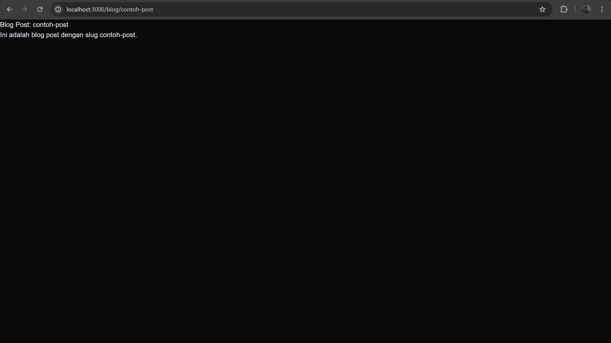
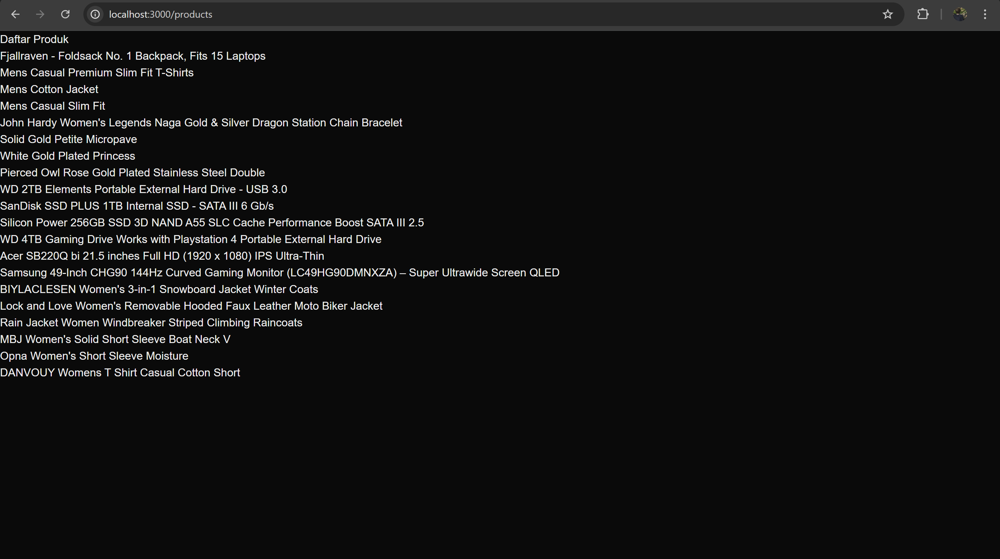
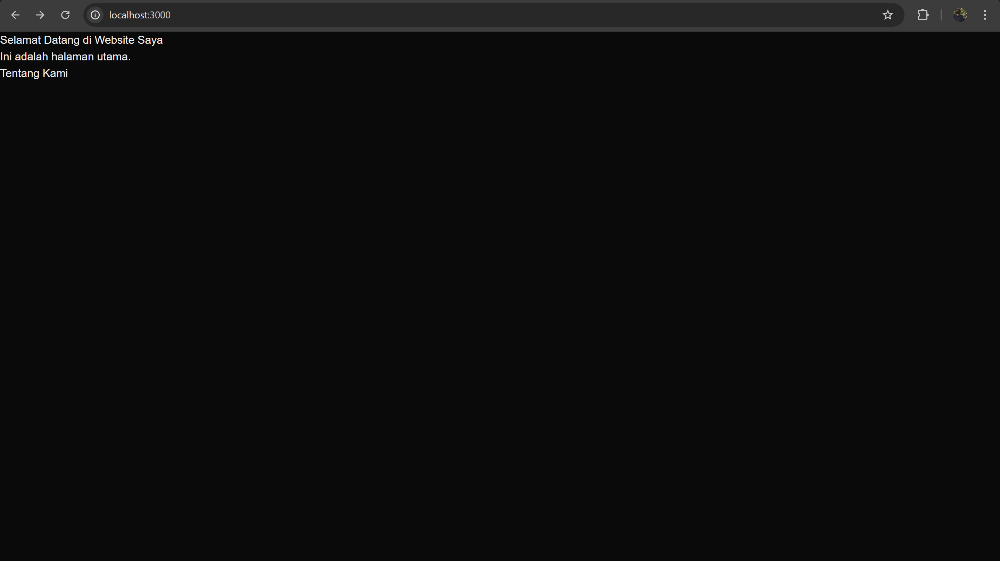
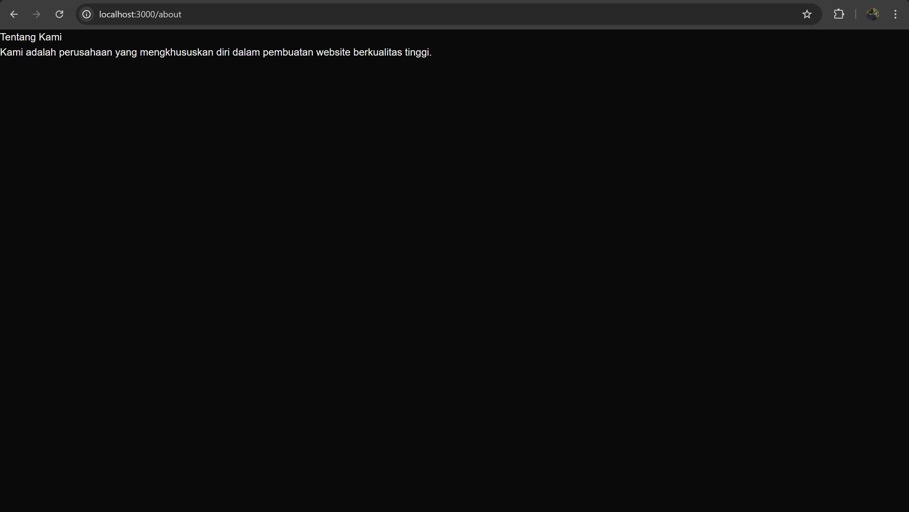
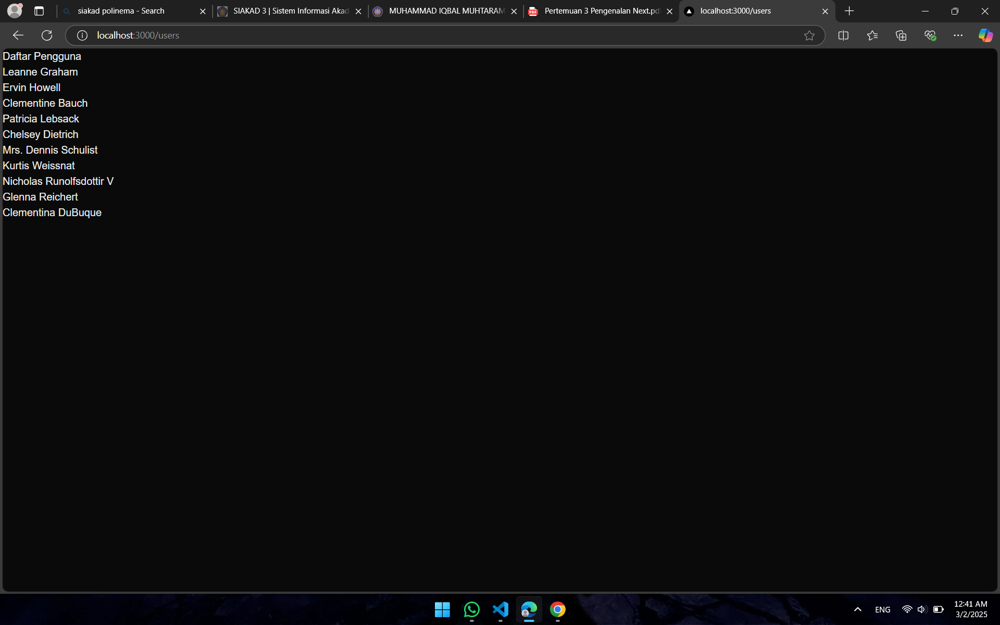
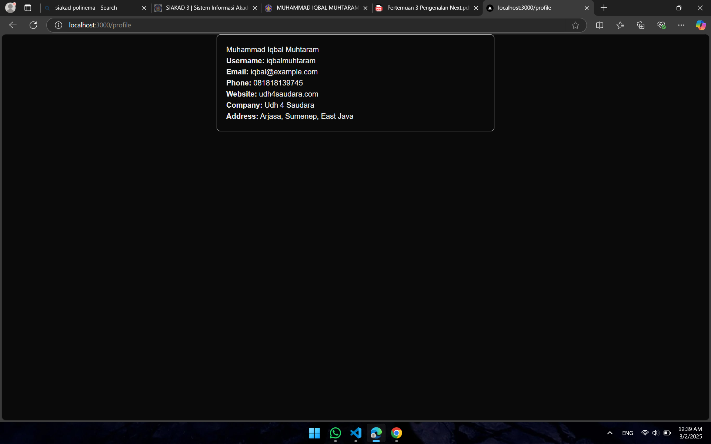
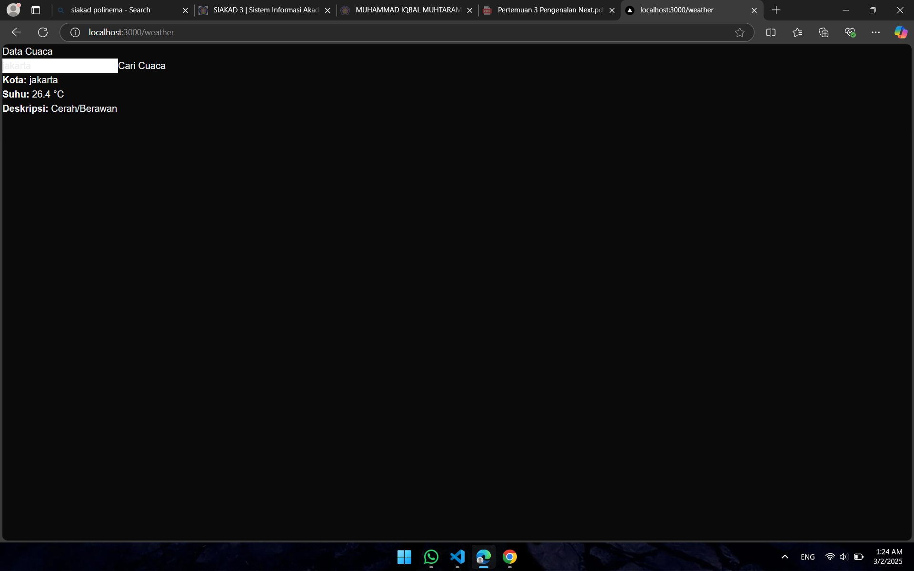

## Praktikum
**A. Persiapan Lingkungan**
1. Pastikan Node.js dan npm sudah terinstal di komputer Anda. Anda dapat memeriksanya dengan
menjalankan perintah berikut di terminal atau command prompt:

2. Buat direktori baru untuk proyek Next.js Anda
3. Inisialisasi proyek Next.js dengan menjalankan perintah berikut: Perhatikan bahwa App Router
belum digunakan

4. Jalankan aplikasi Next.js dengan perintah:
    
    Aplikasi akan terbuka di browser pada alamat http://localhost:3000.

**B. Membuat Halaman dengan Server-Side Rendering (SSR)**
1. Buka file pages/index.tsx di text editor Anda.
2. Ganti kode di dalamnya dengan kode berikut untuk membuat halaman sederhana:
    ```
    import React from "react";

    const HomePage = () => {
    return(
        <div>
        <h1>Selamat Datang di Website Saya!</h1>
        <p>Ini adalah halaman utama.</p>
        </div>
    );
    };

    export default HomePage;
    ```
3. Simpan file dan lihat perubahan di browser. Anda akan melihat halaman utama dengan teks
"Selamat Datang di Website Saya!"


**C. Menggunakan Static Site Generation (SSG)**
1. Buat file baru di direktori pages dengan nama blog.js.
2. Tambahkan kode berikut untuk membuat halaman blog dengan SSG:
    ```
    import React from 'react';

    const Blog = ({posts}) => {
        return (
            <div>
                <h1>Blog Saya</h1>
                {posts.map((post) => (
                    <div key={post.id}>
                        <h2>{post.title}</h2>
                        <p>{post.body}</p>
                    </div>  
                ))}
            </div>
        );
    };

    export async function getStaticProps() {
        const res = await fetch('https://jsonplaceholder.typicode.com/posts');
        const posts = await res.json();

        return{
            props: {
                posts,
            },
        };
    }

    export default Blog;
    ```
3. Simpan file dan buka http://localhost:3000/blog di browser. Anda akan melihat daftar post yang
diambil dari API eksternal.


**D. Menggunakan Dynamic Routes**
1. Buat direktori baru di pages dengan nama blog.
2. Buat file di dalam direktori blog dengan nama [slug].js
3. Tambahkan kode berikut untuk membuat halaman dinamis berdasarkan slug:
    ```
    import {useRouter} from 'next/router';

    const BlogPost = () => {
        const router = useRouter();
        const {slug} = router.query;
        
        return(
            <div>
                <h1>Blog Post: {slug}</h1>
                <p>Ini adalah blog post dengan slug {slug}.</p>
            </div>
        );
    };

    export default BlogPost;
    ```
4. Simpan file dan buka http://localhost:3000/blog/contoh-post di browser. Anda akan melihat
halaman yang menampilkan slug dari URL.


**E. Menggunakan API Routes**
1. Pastikan terdapat direktori di pages dengan nama api.
2. Buat file di dalam direktori api dengan nama products.js.
3. Tambahkan kode berikut untuk membuat API route yang mengembalikan daftar produk:
    ```
    export default async function handler(req, res){
        const response = await fetch('https://fakestoreapi.com/products');
        const products = await response.json();

        res.status(200).json(products);
    }
    ```
4. Buat file baru di pages dengan nama products.js untuk menampilkan daftar produk:
    ```
    import {useState, useEffect} from 'react';

    const ProductList = () => {
        const [products, setProducts] = useState([]);

        useEffect(() => {
            const fetchProducts = async () => {
                const response = await fetch('/api/products');
                const products = await response.json();
                setProducts(products);
            };
            fetchProducts();
        }, []);

        return (
            <div>
                <h1>Daftar Produk</h1>
                <ul>
                    {products.map((product) => (
                        <li key={product.id}>{product.title}</li>
                    ))}
                </ul>
            </div>
        );
    };

    export default ProductList;
    ```
5. Simpan file dan buka http://localhost:3000/products di browser. Anda akan melihat daftar
produk yang diambil dari API route.


**F. Menggunakan Link Component**
1. Buka file pages/index.tsx dan tambahkan modif dengan kode berikut untuk membuat link ke
halaman lain:
    ```
    import Link from 'next/link';

    const HomePage = () => {
    return (
        <div>
        <h1>Selamat Datang di  Website Saya</h1>
        <p>Ini adalah halaman utama.</p>
        <Link href="/about">
            Tentang Kami
        </Link>
        </div>
    );
    };

    export default HomePage;
    ```
2. Buat file baru di pages dengan nama about.js untuk halaman "Tentang Kami":
    ```
    const AboutPage = () => {
        return (
            <div>
                <h1>Tentang Kami</h1>
                <p>Kami adalah perusahaan yang mengkhususkan diri dalam pembuatan website berkualitas tinggi.</p>
            </div>
        )
    }

    export default AboutPage;
    ```
3. Simpan file dan buka http://localhost:3000 di browser. Klik link "Tentang Kami" untuk navigasi
ke halaman tentang.



## Tugas 
1. Buat halaman baru dengan menggunakan Static Site Generation (SSG) yang menampilkan daftar
pengguna dari API https://jsonplaceholder.typicode.com/users.

**jawaban**

Fungsi: Mengambil data pengguna saat build time agar halaman lebih cepat dan SEO-friendly.
Metode: Menggunakan getStaticProps untuk mengambil data dan merender daftar pengguna dalam komponen yang menggunakan Link untuk mengarahkan ke halaman detail.


2. Implementasikan Dynamic Routes untuk menampilkan detail pengguna berdasarkan ID.

**jawaban**

Fungsi: Menampilkan detail pengguna berdasarkan ID yang diambil secara dinamis.
Metode:
getStaticPaths untuk menentukan path dinamis berdasarkan data pengguna.
getStaticProps untuk mengambil data detail pengguna berdasarkan ID.


3. Buat API route yang mengembalikan data cuaca dari API eksternal (misalnya,
OpenWeatherMap) dan tampilkan data tersebut di halaman front-end.

**jawaban**

Fungsi: Mengamankan pemanggilan API eksternal dan memproses data cuaca sebelum dikirim ke front-end.
Metode:
Menerima query parameter city dari frontend.
Menggunakan objek yang berisi koordinat kota untuk memanggil API Open-Meteo.
Mengembalikan data cuaca berupa suhu dan deskripsi (diatur manual).

Fungsi: Memberikan interaksi bagi pengguna untuk memasukkan nama kota dan melihat data cuaca.
Metode:
Menggunakan state untuk mengelola input, data yang diterima, dan error handling.
Mengirim request ke API route dan menampilkan hasilnya.

